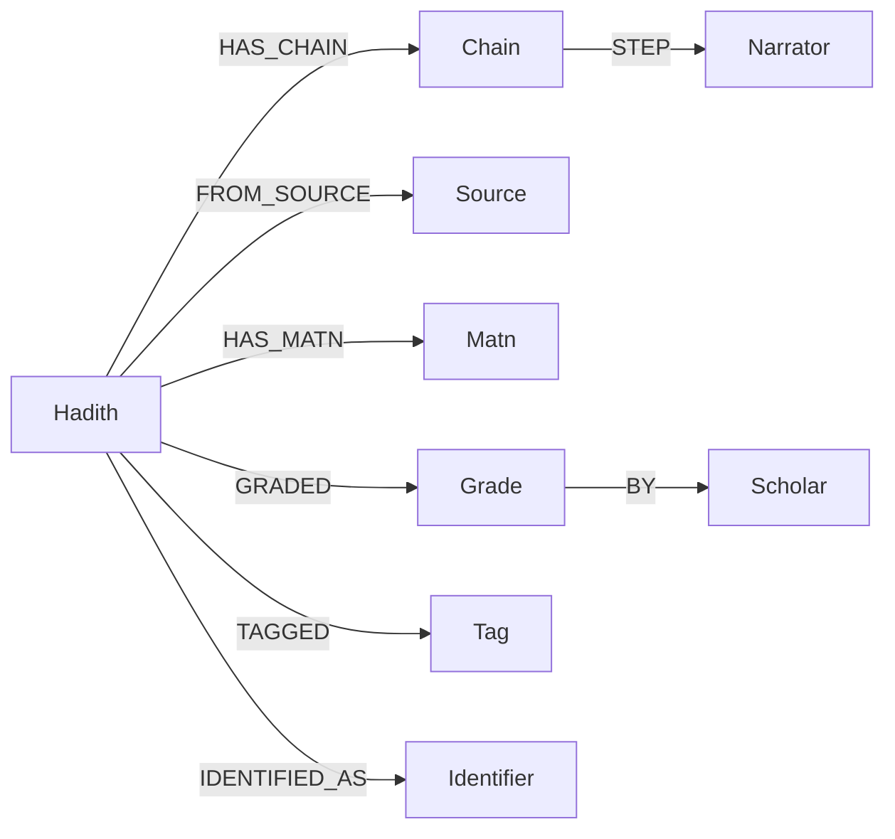

# Riwayyaat Architecture (Developer Overview)

## Stack at a Glance
- **Frontend**: Next.js 16 (App Router), React 19, Tailwind v4
- **Database**: PostgreSQL (hadith schema, pgvector), Neo4j (graph projection)
- **AI**: OpenAI Chat + Embeddings
- **Code organization**: `src/app` (routes), `src/features/*` (domain UI/services), `src/server/*` (db, graph, rag, sync)

## Data & Sync Flow
- **Admin → Postgres**: Admin console creates/updates/soft-deletes hadith. Tables include hadith, matn, chain, narrator, tags, grades, identifiers, etc. `updated_at` triggers exist on core tables.
- **Delta Sync Queue**: `hadith_sync_queue` tracks per-hadith updates. Admin writes enqueue rows with `needs_graph/needs_embedding`.
- **Delta Processor**: `processHadithSyncBatch` (or `npm run sync:delta`) processes the queue:
  - Refreshes Neo4j projection for that hadith (delete subgraph, re-merge fresh data; if soft-deleted, remove node).
  - Refreshes embeddings for that hadith’s matn.
- **Full Rebuild**: `npm run graph:sync` rebuilds the entire graph; `npm run rag:backfill` regenerates embeddings for all hadith.

## RAG Pipeline
- **Embeddings**: `hadith_embedding` (pgvector). Generated from matn text via `src/server/rag/embeddings`.
- **Retriever**: `retrieveHadithForQuestion` does vector search + filters (source/book/chapter/tags/grades/scholars) over pgvector and hadith tables.
- **Generator**: `generateRagAnswer` applies strict system prompt (no fatwa, no speculation, citations required), calls OpenAI Chat, validates citations.
- **API**: `/api/rag/query` ties retriever + generator, logs to `rag_logs`.
- **Workspace UI**: Chat sends questions to `/api/rag/query`, renders answer + citations; clicking a citation focuses the hadith.

## Graph Layer (Neo4j)
- **Projection**: Nodes for Hadith, Matn, Source/Book/Chapter, Chain, Narrator, Grade, Scholar, Tag, Identifier, lookup types (chain/narration/attribution, reliability, transmission, tiers). Relationships such as HAS_CHAIN, STEP, TAGGED, IDENTIFIED_AS, GRADED, etc.
- **Sync**: `scripts/graph-sync.ts` (full), delta processor updates per-hadith.
- **APIs**: `/api/graph/chain`, `/api/graph/narrator-network`, `/api/graph/variants` provide graph JSON (nodes/edges/variants).
- **Workspace UI**: Graph tab in hadith details renders isnād graph, narrator network, variants via react-force-graph.

**Figure 2. Conceptual KG model**



**Figure 3. RAG pipeline**

```mermaid
graph LR
  Question --> Api[POST /api/rag/query]
  Api --> Retrieve[retrieveHadithForQuestion (rag/retriever.ts)]
  Retrieve --> Generate[generateRagAnswer (rag/generator.ts)]
  Generate --> Validate[parseAndValidateAnswer (rag/generator.ts)]
  Validate --> Log[logRagInteraction (rag_logs)]
```

## Key Commands
- `npm run dev` — start Next.js in dev.
- `npm run graph:sync` — full Neo4j rebuild from Postgres.
- `npm run rag:backfill` — generate embeddings for all hadith.
- `npm run sync:delta` — process delta queue (Neo4j + embeddings refresh).

## Safety & Limitations
- Tool is for study/exploration only; not a fatwa tool.
- Uses only the loaded hadith dataset; may be incomplete.
- AI can be wrong; always verify with qualified scholars.
- Depends on OpenAI API and pgvector index for retrieval; Neo4j for graph views.
